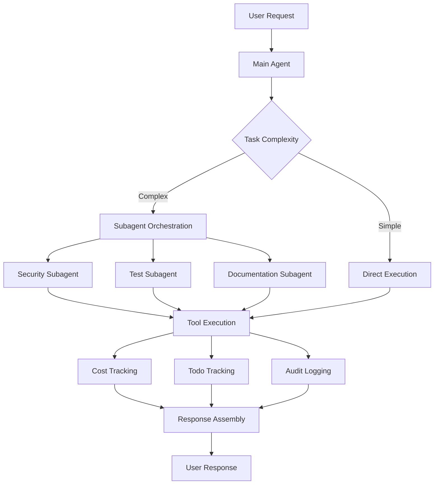

# Claude Enterprise Features Implementation Guide

## Executive Summary

This document provides a comprehensive implementation roadmap for integrating Claude's advanced features into our enterprise AI agent CLI framework. Based on official Claude documentation analysis, this guide outlines architecture, implementation patterns, security considerations, and best practices for production deployment.

**Implementation Status**: Phase 1-3 Complete | Phase 4-6 In Progress

---

## Table of Contents

1. [Architecture Overview](#architecture-overview)
2. [Core Infrastructure](#core-infrastructure)
3. [Tool Ecosystem](#tool-ecosystem)
4. [Advanced Features](#advanced-features)
5. [Enterprise Integration](#enterprise-integration)
6. [Security & Compliance](#security--compliance)
7. [Implementation Roadmap](#implementation-roadmap)
8. [Performance Optimization](#performance-optimization)

---

## Architecture Overview

### Layered Architecture

```
┌─────────────────────────────────────────────────────────┐
│              User Interface Layer                        │
│  (CLI, Web UI, API Endpoints, IDE Extensions)           │
└─────────────────────────────────────────────────────────┘
                          ↓
┌─────────────────────────────────────────────────────────┐
│         Agent Orchestration Layer                        │
│  (Main Agent, Subagents, Task Distribution)             │
└─────────────────────────────────────────────────────────┘
                          ↓
┌─────────────────────────────────────────────────────────┐
│           Tool Execution Layer                           │
│  (Built-in Tools, Custom MCP Tools, Platform Tools)     │
└─────────────────────────────────────────────────────────┘
                          ↓
┌─────────────────────────────────────────────────────────┐
│        Infrastructure Layer                              │
│  (Streaming, Cost Tracking, Todo Management, Security)  │
└─────────────────────────────────────────────────────────┘
                          ↓
┌─────────────────────────────────────────────────────────┐
│          Claude API Layer                                │
│  (Messages API, Streaming API, Tool Use Protocol)       │
└─────────────────────────────────────────────────────────┘
```

### Component Relationships



---

## Core Infrastructure

### 1. Streaming Architecture

#### Streaming Input Mode (Recommended)

**Purpose**: Long-lived agent processes with persistent state and real-time interaction.

**Key Features**:

- Persistent conversation context
- Real-time progress updates
- Permission request handling
- Image attachment support
- Interruption capability
- Tool and MCP server integration
- Lifecycle hooks

**Implementation**:

```typescript
// lib/streaming/streaming-agent.ts

import { Anthropic } from "@anthropic-ai/sdk";

export interface StreamingConfig {
  model?: "claude-sonnet-4-5" | "claude-opus-4-1" | "claude-haiku-4-5";
  maxTurns?: number;
  maxTokens?: number;
  allowedTools?: string[];
  agents?: AgentDefinitions;
  mcpServers?: MCPServers;
  betas?: string[];
}

export class StreamingAgent {
  private client: Anthropic;
  private conversationHistory: Message[] = [];
  private processedMessageIds: Set<string> = new Set();

  constructor(apiKey: string) {
    this.client = new Anthropic({ apiKey });
  }

  async *query(
    messageGenerator: AsyncGenerator<UserMessage>,
    config: StreamingConfig,
  ): AsyncGenerator<AgentMessage> {
    const betas = config.betas || [];

    // Add fine-grained streaming for performance
    if (!betas.includes("fine-grained-tool-streaming-2025-05-14")) {
      betas.push("fine-grained-tool-streaming-2025-05-14");
    }

    let turns = 0;
    const maxTurns = config.maxTurns || 20;

    // Consume input messages
    for await (const userMessage of messageGenerator) {
      this.conversationHistory.push(userMessage);

      while (turns < maxTurns) {
        turns++;

        // Create streaming request
        const stream = await this.client.messages.stream({
          model: config.model || "claude-sonnet-4-5",
          max_tokens: config.maxTokens || 4096,
          messages: this.conversationHistory,
          tools: this.getToolDefinitions(config.allowedTools),
          // @ts-ignore - beta parameter
          betas,
        });

        // Stream events
        for await (const event of stream) {
          yield this.processStreamEvent(event);
        }

        // Get final message
        const message = await stream.finalMessage();

        // Handle tool use
        if (message.stop_reason === "tool_use") {
          this.conversationHistory.push({
            role: "assistant",
            content: message.content,
          });

          // Execute tools
          const toolResults = await this.executeTools(message.content);

          this.conversationHistory.push({
            role: "user",
            content: toolResults,
          });

          continue; // Next turn
        }

        // End of turn
        break;
      }
    }
  }

  private processStreamEvent(event: any): AgentMessage {
    // Process streaming events
    if (event.type === "content_block_delta") {
      return {
        type: "delta",
        delta: event.delta,
      };
    }

    if (event.type === "message_start") {
      return {
        type: "start",
        message: event.message,
      };
    }

    return { type: "unknown", event };
  }
}
```

#### Single Message Mode

**Purpose**: Stateless execution for serverless environments.

**Use Cases**:

- AWS Lambda functions
- Cloud Functions
- Simple API endpoints
- Batch processing

**Limitations**:

- No image attachments
- No message queueing
- No interruptions
- No lifecycle hooks

**Decision Matrix**:

| Feature              | Streaming Mode | Single Message Mode |
| -------------------- | -------------- | ------------------- |
| Interactive Sessions | ✅             | ❌                  |
| Long Conversations   | ✅             | ❌                  |
| Image Support        | ✅             | ❌                  |
| Serverless           | ⚠️ Possible    | ✅ Ideal            |
| Real-time Updates    | ✅             | ❌                  |
| State Management     | ✅ Built-in    | ❌ Manual           |

### 2. Cost Tracking System

**Critical Rules**:

1. **Same ID = Same Usage**: All messages with identical ID report same usage
2. **Result is Authoritative**: Final message contains cumulative totals
3. **Deduplicate Rigorously**: Process each message ID only once

**Implementation**:

```typescript
// lib/tracking/cost-tracker.ts

export interface Usage {
  input_tokens: number;
  output_tokens: number;
  cache_creation_input_tokens?: number;
  cache_read_input_tokens?: number;
}

export interface StepUsage {
  messageId: string;
  timestamp: Date;
  usage: Usage;
  costUsd: number;
  userId?: string;
  projectId?: string;
}

export class CostTracker {
  private processedMessageIds: Set<string> = new Set();
  private stepUsages: StepUsage[] = [];
  private modelPricing: ModelPricing;
  private orgBudget: number;
  private alertThresholds: number[];

  constructor(config: CostTrackerConfig) {
    this.modelPricing = config.pricing;
    this.orgBudget = config.orgBudget;
    this.alertThresholds = config.alertThresholds || [0.5, 0.75, 0.9, 0.95];
  }

  async onMessage(
    message: AgentMessage,
    context?: TrackingContext,
  ): Promise<void> {
    // Only process assistant messages with usage
    if (message.type !== "assistant" || !message.usage) {
      return;
    }

    // Deduplicate by message ID
    if (this.processedMessageIds.has(message.id)) {
      return;
    }

    this.processedMessageIds.add(message.id);

    // Calculate cost
    const cost = this.calculateCost(message.usage, message.model);

    // Record usage
    const stepUsage: StepUsage = {
      messageId: message.id,
      timestamp: new Date(),
      usage: message.usage,
      costUsd: cost,
      userId: context?.userId,
      projectId: context?.projectId,
    };

    this.stepUsages.push(stepUsage);

    // Check budget thresholds
    await this.checkBudgetThresholds();
  }

  private calculateCost(usage: Usage, model: string): number {
    const pricing = this.modelPricing[model];

    if (!pricing) {
      throw new Error(`Unknown model pricing: ${model}`);
    }

    const inputCost = usage.input_tokens * pricing.inputTokenRate;
    const outputCost = usage.output_tokens * pricing.outputTokenRate;
    const cacheCreationCost =
      (usage.cache_creation_input_tokens || 0) * pricing.cacheCreationRate;
    const cacheReadCost =
      (usage.cache_read_input_tokens || 0) * pricing.cacheReadRate;

    return inputCost + outputCost + cacheCreationCost + cacheReadCost;
  }

  private async checkBudgetThresholds(): Promise<void> {
    const totalCost = this.getTotalCost();
    const percentUsed = totalCost / this.orgBudget;

    for (const threshold of this.alertThresholds) {
      if (percentUsed >= threshold && !this.hasAlerted(threshold)) {
        await this.sendAlert({
          threshold,
          totalCost,
          orgBudget: this.orgBudget,
          percentUsed: percentUsed * 100,
        });

        this.markAlerted(threshold);
      }
    }

    // Hard limit enforcement
    if (percentUsed >= 1.0) {
      throw new BudgetExceededError(
        `Organization budget exceeded: $${totalCost.toFixed(2)} / $${this.orgBudget}`,
      );
    }
  }

  getTotalCost(): number {
    return this.stepUsages.reduce((sum, step) => sum + step.costUsd, 0);
  }

  getUserCost(userId: string): number {
    return this.stepUsages
      .filter((step) => step.userId === userId)
      .reduce((sum, step) => sum + step.costUsd, 0);
  }

  getProjectCost(projectId: string): number {
    return this.stepUsages
      .filter((step) => step.projectId === projectId)
      .reduce((sum, step) => sum + step.costUsd, 0);
  }

  generateReport(): CostReport {
    return {
      totalCost: this.getTotalCost(),
      totalSteps: this.stepUsages.length,
      totalInputTokens: this.stepUsages.reduce(
        (sum, s) => sum + s.usage.input_tokens,
        0,
      ),
      totalOutputTokens: this.stepUsages.reduce(
        (sum, s) => sum + s.usage.output_tokens,
        0,
      ),
      cacheHitRate: this.calculateCacheHitRate(),
      byUser: this.aggregateByUser(),
      byProject: this.aggregateByProject(),
      byModel: this.aggregateByModel(),
      timeline: this.generateTimeline(),
    };
  }
}
```

### 3. Todo Tracking System

**Purpose**: Provide user transparency into complex multi-step operations.

**Activation Criteria**:

- Complex multi-step tasks (3+ actions)
- User-provided task lists
- Non-trivial operations
- Explicit user requests

**Skip When**:

- Single straightforward task
- Trivial operations
- <3 simple steps
- Conversational requests

**Implementation**:

```typescript
// lib/tracking/todo-tracker.ts

export interface Todo {
  id: string;
  content: string; // Imperative: "Run tests"
  activeForm: string; // Present continuous: "Running tests"
  status: "pending" | "in_progress" | "completed";
  createdAt: Date;
  startedAt?: Date;
  completedAt?: Date;
  error?: string;
}

export class TodoTracker {
  private todos: Todo[] = [];
  private listeners: TodoListener[] = [];

  onMessage(message: AgentMessage): void {
    for (const block of message.content) {
      if (block.type === "tool_use" && block.name === "TodoWrite") {
        this.updateTodos(block.input.todos);
      }
    }
  }

  private updateTodos(newTodos: TodoInput[]): void {
    // Create new todo objects with timestamps
    this.todos = newTodos.map((todo, index) => {
      const existing = this.todos[index];

      const todoObj: Todo = {
        id: existing?.id || this.generateId(),
        content: todo.content,
        activeForm: todo.activeForm,
        status: todo.status,
        createdAt: existing?.createdAt || new Date(),
        startedAt:
          todo.status === "in_progress" && !existing?.startedAt
            ? new Date()
            : existing?.startedAt,
        completedAt:
          todo.status === "completed" && !existing?.completedAt
            ? new Date()
            : existing?.completedAt,
      };

      return todoObj;
    });

    // Notify listeners
    this.notifyListeners();
  }

  getProgress(): TodoProgress {
    const total = this.todos.length;
    const completed = this.todos.filter((t) => t.status === "completed").length;
    const inProgress = this.todos.filter(
      (t) => t.status === "in_progress",
    ).length;
    const pending = this.todos.filter((t) => t.status === "pending").length;

    return {
      total,
      completed,
      inProgress,
      pending,
      percentComplete: total > 0 ? (completed / total) * 100 : 0,
    };
  }

  display(): string {
    const progress = this.getProgress();
    const lines: string[] = [];

    lines.push(
      `\n━━━ Progress: ${progress.completed}/${progress.total} tasks (${progress.percentComplete.toFixed(0)}%) ━━━\n`,
    );

    const icons = {
      completed: "✅",
      in_progress: "🔧",
      pending: "⏳",
    };

    for (const todo of this.todos) {
      const icon = icons[todo.status];
      const text =
        todo.status === "in_progress" ? todo.activeForm : todo.content;
      const duration = this.getDuration(todo);

      lines.push(`${icon} ${text}${duration ? ` (${duration})` : ""}`);
    }

    lines.push("");
    return lines.join("\n");
  }

  private getDuration(todo: Todo): string | null {
    if (todo.status === "completed" && todo.startedAt && todo.completedAt) {
      const ms = todo.completedAt.getTime() - todo.startedAt.getTime();
      return this.formatDuration(ms);
    }

    if (todo.status === "in_progress" && todo.startedAt) {
      const ms = Date.now() - todo.startedAt.getTime();
      return this.formatDuration(ms);
    }

    return null;
  }

  private formatDuration(ms: number): string {
    const seconds = Math.floor(ms / 1000);
    const minutes = Math.floor(seconds / 60);
    const hours = Math.floor(minutes / 60);

    if (hours > 0) return `${hours}h ${minutes % 60}m`;
    if (minutes > 0) return `${minutes}m ${seconds % 60}s`;
    return `${seconds}s`;
  }
}
```

---

## Tool Ecosystem

### Built-in Tools

#### 1. Bash Tool

**Purpose**: Execute shell commands in persistent bash session.

**Security Requirements**:

- Docker/VM isolation mandatory
- Command filtering/allowlists
- Resource limits (ulimit)
- 30-second timeouts
- Comprehensive audit logging

**Implementation**:

```typescript
// lib/tools/bash-tool.ts

export interface BashToolConfig {
  timeout?: number;
  maxOutputSize?: number;
  allowedCommands?: RegExp[];
  blockedPatterns?: RegExp[];
  resourceLimits?: ResourceLimits;
}

export class BashTool {
  private sessionState: Map<string, BashSession> = new Set();
  private config: BashToolConfig;
  private auditLogger: AuditLogger;

  constructor(config: BashToolConfig) {
    this.config = {
      timeout: config.timeout || 30000, // 30 seconds
      maxOutputSize: config.maxOutputSize || 1048576, // 1MB
      allowedCommands: config.allowedCommands || [],
      blockedPatterns:
        config.blockedPatterns || this.getDefaultBlockedPatterns(),
      resourceLimits: config.resourceLimits || this.getDefaultLimits(),
    };

    this.auditLogger = new AuditLogger("bash-tool");
  }

  private getDefaultBlockedPatterns(): RegExp[] {
    return [
      /rm\s+-rf\s+\//, // Dangerous deletions
      /curl.*http:\/\//, // External HTTP
      /wget.*/, // External downloads
      /sudo/, // Privilege escalation
      /chmod\s+777/, // Insecure permissions
      /mkfs/, // Filesystem formatting
      /dd\s+if=/, // Disk operations
      />\/dev\/sd[a-z]/, // Direct disk writes
      /:(){ :|:& };:/, // Fork bomb
    ];
  }

  private getDefaultLimits(): ResourceLimits {
    return {
      maxMemoryGB: 5,
      maxDiskGB: 5,
      maxCPUSeconds: 300,
      maxProcesses: 100,
    };
  }

  async execute(
    command: string,
    options?: BashExecuteOptions,
  ): Promise<BashResult> {
    // Validate command
    this.validateCommand(command);

    // Log execution
    await this.auditLogger.log({
      tool: "bash",
      command,
      userId: options?.userId,
      timestamp: new Date(),
    });

    // Get or create session
    const sessionId = options?.sessionId || "default";
    const session = this.getSession(sessionId);

    try {
      // Execute in isolated environment
      const result = await this.executeInContainer(session, command, options);

      return {
        stdout: result.stdout,
        stderr: result.stderr,
        exitCode: result.exitCode,
        duration: result.duration,
        sessionId,
      };
    } catch (error) {
      await this.auditLogger.error({
        tool: "bash",
        command,
        error: error.message,
        userId: options?.userId,
      });

      throw error;
    }
  }

  private validateCommand(command: string): void {
    // Check blocked patterns
    for (const pattern of this.config.blockedPatterns) {
      if (pattern.test(command)) {
        throw new SecurityError(
          `Command blocked by security policy: matches pattern ${pattern}`,
        );
      }
    }

    // Check allowlist if configured
    if (this.config.allowedCommands.length > 0) {
      const allowed = this.config.allowedCommands.some((pattern) =>
        pattern.test(command),
      );

      if (!allowed) {
        throw new SecurityError(`Command not in allowlist: ${command}`);
      }
    }
  }

  private async executeInContainer(
    session: BashSession,
    command: string,
    options?: BashExecuteOptions,
  ): Promise<ExecutionResult> {
    const container = session.container;

    // Set resource limits
    await container.setResourceLimits(this.config.resourceLimits);

    // Execute with timeout
    const startTime = Date.now();

    const result = await Promise.race([
      container.exec(command),
      this.timeout(this.config.timeout),
    ]);

    const duration = Date.now() - startTime;

    // Truncate output if too large
    if (result.stdout.length > this.config.maxOutputSize) {
      result.stdout =
        result.stdout.substring(0, this.config.maxOutputSize) +
        "\n\n[Output truncated due to size limit]";
    }

    return {
      ...result,
      duration,
    };
  }

  private timeout(ms: number): Promise<never> {
    return new Promise((_, reject) => {
      setTimeout(
        () => reject(new TimeoutError(`Command exceeded ${ms}ms timeout`)),
        ms,
      );
    });
  }
}
```

#### 2. Code Execution Tool

**Purpose**: Execute Python code and bash commands in secure sandboxed environment.

**Specifications**:

- Runtime: Python 3.11.12 on Linux
- Resources: 5GB RAM, 5GB disk, 1 CPU
- Network: Isolated (no internet)
- Lifespan: 30 days
- Pricing: $0.05/hour (50 free hours/day/org)

**Implementation**:

```typescript
// lib/tools/code-execution-tool.ts

export interface CodeExecutionConfig {
  containerId?: string;
  files?: FileUpload[];
  timeout?: number;
  language?: "python" | "bash";
}

export class CodeExecutionTool {
  private client: Anthropic;
  private containerRegistry: Map<string, Container> = new Map();

  constructor(apiKey: string) {
    this.client = new Anthropic({
      apiKey,
      defaultHeaders: {
        "anthropic-beta": "code-execution-2025-08-25",
      },
    });
  }

  async execute(
    code: string,
    config?: CodeExecutionConfig,
  ): Promise<CodeExecutionResult> {
    // Prepare tool use message
    const tools = [
      {
        type: "code_execution_20250825",
        name: "code_execution",
      },
    ];

    // Include container ID for state reuse
    const request: any = {
      model: "claude-sonnet-4-5",
      max_tokens: 4096,
      tools,
      messages: [
        {
          role: "user",
          content: `Execute this code:\n\n\`\`\`${config?.language || "python"}\n${code}\n\`\`\``,
        },
      ],
    };

    if (config?.containerId) {
      request.container_id = config.containerId;
    }

    // Execute
    const response = await this.client.messages.create(request);

    // Extract result
    for (const block of response.content) {
      if (block.type === "tool_use" && block.name === "code_execution") {
        const result = block.input;

        // Store container ID for reuse
        if (response.container_id) {
          this.containerRegistry.set(response.container_id, {
            id: response.container_id,
            createdAt: new Date(),
            files: config?.files || [],
          });
        }

        return {
          stdout: result.stdout,
          stderr: result.stderr,
          returnCode: result.return_code,
          metadata: result.metadata,
          errorCode: result.error_code,
          containerId: response.container_id,
        };
      }
    }

    throw new Error("No code execution result found in response");
  }

  async uploadFile(containerId: string, file: FileUpload): Promise<void> {
    // Upload file to container using Files API
    const fileResponse = await this.client.files.create({
      file: file.data,
      purpose: "code_execution",
    });

    // Associate with container
    const container = this.containerRegistry.get(containerId);
    if (container) {
      container.files.push(fileResponse);
    }
  }

  async listContainers(): Promise<Container[]> {
    return Array.from(this.containerRegistry.values());
  }

  async destroyContainer(containerId: string): Promise<void> {
    this.containerRegistry.delete(containerId);
  }
}
```

#### 3. Text Editor Tool

**Purpose**: Direct file examination and modification.

**Versions**:

- Claude 4.x: `text_editor_20250728` (no undo)
- Claude Sonnet 3.7: `text_editor_20250124` (with undo)

**Commands**:

- `view`: Display file contents
- `str_replace`: Replace text strings
- `create`: Generate new files
- `insert`: Add text at line numbers
- `undo_edit`: Revert changes (3.7 only)

**Implementation**:

```typescript
// lib/tools/text-editor-tool.ts

export type EditorCommand =
  | "view"
  | "str_replace"
  | "create"
  | "insert"
  | "undo_edit";

export interface TextEditorConfig {
  version?: "text_editor_20250728" | "text_editor_20250124";
  maxCharacters?: number;
  backupEnabled?: boolean;
  validateSyntax?: boolean;
}

export class TextEditorTool {
  private config: TextEditorConfig;
  private backups: Map<string, FileBackup[]> = new Map();
  private undoStack: Map<string, EditOperation[]> = new Map();

  constructor(config?: TextEditorConfig) {
    this.config = {
      version: config?.version || "text_editor_20250728",
      maxCharacters: config?.maxCharacters || 10000,
      backupEnabled: config?.backupEnabled !== false,
      validateSyntax: config?.validateSyntax !== false,
    };
  }

  getToolDefinition(): ToolDefinition {
    return {
      type: this.config.version,
      name: "str_replace_based_edit_tool",
      max_characters: this.config.maxCharacters,
    };
  }

  async view(path: string, lineRange?: [number, number]): Promise<ViewResult> {
    // Validate path
    this.validatePath(path);

    // Read file
    const content = await fs.readFile(path, "utf-8");

    // Apply line range if specified
    if (lineRange) {
      const lines = content.split("\n");
      const [start, end] = lineRange;
      const selectedLines = lines.slice(start - 1, end);

      return {
        path,
        content: selectedLines.join("\n"),
        lineRange,
        totalLines: lines.length,
      };
    }

    return {
      path,
      content,
      totalLines: content.split("\n").length,
    };
  }

  async strReplace(
    path: string,
    oldText: string,
    newText: string,
  ): Promise<ReplaceResult> {
    // Validate path
    this.validatePath(path);

    // Backup if enabled
    if (this.config.backupEnabled) {
      await this.createBackup(path);
    }

    // Read file
    const content = await fs.readFile(path, "utf-8");

    // Find matches
    const matches = this.findMatches(content, oldText);

    if (matches.length === 0) {
      throw new EditorError("No matching text found");
    }

    if (matches.length > 1) {
      throw new EditorError(
        `Found ${matches.length} matches. Text must match exactly once. ` +
          `Add more surrounding context to make the match unique.`,
      );
    }

    // Replace
    const newContent = content.replace(oldText, newText);

    // Validate syntax if enabled
    if (this.config.validateSyntax) {
      await this.validateSyntax(path, newContent);
    }

    // Write file
    await fs.writeFile(path, newContent, "utf-8");

    // Record operation for undo
    this.recordOperation(path, {
      type: "str_replace",
      oldContent: content,
      newContent,
      timestamp: new Date(),
    });

    return {
      path,
      matchCount: matches.length,
      replacedText: oldText,
      newText,
      success: true,
    };
  }

  async create(path: string, content: string): Promise<CreateResult> {
    // Validate path
    this.validatePath(path);

    // Check if file exists
    if (await this.fileExists(path)) {
      throw new EditorError(`File already exists: ${path}`);
    }

    // Validate syntax
    if (this.config.validateSyntax) {
      await this.validateSyntax(path, content);
    }

    // Create file
    await fs.writeFile(path, content, "utf-8");

    return {
      path,
      linesCreated: content.split("\n").length,
      success: true,
    };
  }

  async insert(
    path: string,
    lineNumber: number,
    text: string,
  ): Promise<InsertResult> {
    // Validate path
    this.validatePath(path);

    // Backup
    if (this.config.backupEnabled) {
      await this.createBackup(path);
    }

    // Read file
    const content = await fs.readFile(path, "utf-8");
    const lines = content.split("\n");

    // Validate line number
    if (lineNumber < 1 || lineNumber > lines.length + 1) {
      throw new EditorError(
        `Invalid line number: ${lineNumber}. File has ${lines.length} lines.`,
      );
    }

    // Insert
    lines.splice(lineNumber - 1, 0, text);
    const newContent = lines.join("\n");

    // Validate syntax
    if (this.config.validateSyntax) {
      await this.validateSyntax(path, newContent);
    }

    // Write file
    await fs.writeFile(path, newContent, "utf-8");

    // Record operation
    this.recordOperation(path, {
      type: "insert",
      oldContent: content,
      newContent,
      timestamp: new Date(),
    });

    return {
      path,
      lineNumber,
      linesInserted: text.split("\n").length,
      success: true,
    };
  }

  async undoEdit(path: string): Promise<UndoResult> {
    if (this.config.version !== "text_editor_20250124") {
      throw new EditorError("undo_edit only available in text_editor_20250124");
    }

    const stack = this.undoStack.get(path);

    if (!stack || stack.length === 0) {
      throw new EditorError("No operations to undo");
    }

    // Pop last operation
    const operation = stack.pop();

    // Restore old content
    await fs.writeFile(path, operation.oldContent, "utf-8");

    return {
      path,
      operation: operation.type,
      success: true,
    };
  }

  private validatePath(path: string): void {
    // Prevent directory traversal
    if (path.includes("..")) {
      throw new SecurityError("Path traversal not allowed");
    }

    // Ensure path is within allowed directories
    const allowedDirs = [process.cwd(), "/tmp"];
    const resolved = require("path").resolve(path);

    const isAllowed = allowedDirs.some((dir) =>
      resolved.startsWith(require("path").resolve(dir)),
    );

    if (!isAllowed) {
      throw new SecurityError(`Path not in allowed directories: ${path}`);
    }
  }

  private async createBackup(path: string): Promise<void> {
    const content = await fs.readFile(path, "utf-8");

    const backup: FileBackup = {
      path,
      content,
      timestamp: new Date(),
    };

    if (!this.backups.has(path)) {
      this.backups.set(path, []);
    }

    this.backups.get(path).push(backup);

    // Keep only last 10 backups
    const backups = this.backups.get(path);
    if (backups.length > 10) {
      backups.shift();
    }
  }
}
```

---

## Advanced Features

### Subagent Orchestration

**Purpose**: Specialized AI agents for specific tasks, orchestrated by main agent.

**Benefits**:

- Context isolation
- Parallel execution
- Specialized expertise
- Tool restrictions

**Implementation**:

```typescript
// lib/agents/subagent-orchestrator.ts

export interface AgentDefinition {
  description: string; // REQUIRED: Use case indicator
  prompt: string; // REQUIRED: System prompt
  tools?: string[]; // Allowed tools (inherits all if omitted)
  model?: "sonnet" | "opus" | "haiku" | "inherit";
}

export interface AgentDefinitions {
  [agentName: string]: AgentDefinition;
}

export const ENTERPRISE_AGENTS: AgentDefinitions = {
  "security-auditor": {
    description:
      "Performs comprehensive security audits including vulnerability assessment, code review, and compliance checks. ALWAYS use for security reviews and penetration testing analysis.",
    prompt: `You are an expert security auditor with deep knowledge of:
- OWASP Top 10 vulnerabilities and mitigation strategies
- Secure coding practices across multiple languages
- Authentication and authorization patterns (OAuth, JWT, RBAC)
- Data protection and encryption standards
- Supply chain security and dependency analysis
- Security compliance frameworks (SOC2, GDPR, HIPAA, PCI-DSS)

Your findings must include:
1. **Vulnerability Description**: Clear explanation of the security issue
2. **Severity Rating**: Critical/High/Medium/Low with CVSS score
3. **Exploit Scenario**: Step-by-step proof-of-concept (sanitized)
4. **Remediation Steps**: Specific, actionable fixes with code examples
5. **Compliance Impact**: Relevant regulatory and compliance implications

Use chain-of-thought reasoning:
<thinking>
[Analyze the code/system systematically]
1. Review authentication and authorization
2. Check for injection vulnerabilities
3. Assess data protection measures
4. Evaluate security configuration
5. Identify potential attack vectors
</thinking>

<findings>
[Present structured security assessment]
</findings>

<remediation>
[Provide prioritized action items]
</remediation>`,
    tools: ["Read", "Grep", "Glob"],
    model: "opus",
  },

  "test-engineer": {
    description:
      "Writes comprehensive test suites and executes tests. Use for test creation, test execution, coverage analysis, and quality assurance.",
    prompt: `You are a test engineering specialist following TDD best practices:
- Unit tests with high coverage (>80%)
- Integration tests for critical workflows
- Edge case validation and boundary testing
- Performance benchmarks and load tests
- Security test cases

Test structure:
<thinking>
1. Identify testable units
2. Define test scenarios (happy path, edge cases, errors)
3. Create test data and fixtures
4. Implement assertions
5. Verify coverage
</thinking>

<implementation>
[Write comprehensive tests]
</implementation>

<validation>
[Execute tests and report results]
</validation>

Follow AAA pattern (Arrange, Act, Assert) and include descriptive test names.`,
    tools: ["Read", "Write", "Edit", "Bash", "Grep", "Glob"],
    model: "sonnet",
  },

  "documentation-writer": {
    description:
      "Creates clear, comprehensive technical documentation including README files, API documentation, architecture diagrams, and user guides.",
    prompt: `You write excellent technical documentation:
- User-focused language with minimal jargon
- Code examples with explanations
- Visual diagrams in Mermaid format
- Troubleshooting sections with common issues
- Getting started guides for quick onboarding

Documentation structure:
<thinking>
1. Identify target audience
2. Determine key concepts to explain
3. Outline documentation flow
4. Plan code examples
5. Design diagrams
</thinking>

<content>
[Write clear, structured documentation]
</content>

Include:
- Overview and purpose
- Installation/setup instructions
- Usage examples with output
- Configuration options
- API reference (if applicable)
- Troubleshooting guide
- Contributing guidelines`,
    tools: ["Read", "Write", "Edit", "Grep", "Glob"],
    model: "sonnet",
  },

  "performance-optimizer": {
    description:
      "Analyzes and optimizes system performance including algorithm efficiency, database queries, caching, and resource utilization.",
    prompt: `You are a performance optimization expert analyzing:
- Algorithmic complexity (Big O analysis)
- Database query optimization (N+1 queries, indexing)
- Caching strategies (Redis, CDN, memoization)
- Resource utilization (CPU, memory, I/O)
- Scalability patterns (horizontal/vertical scaling)

Optimization process:
<thinking>
1. Profile current performance
2. Identify bottlenecks
3. Analyze algorithmic complexity
4. Review resource usage
5. Propose optimizations
</thinking>

<analysis>
[Performance metrics and bottleneck identification]
</analysis>

<optimizations>
[Specific, measurable improvements with before/after metrics]
</optimizations>

Provide:
- Current performance baseline
- Bottleneck analysis
- Optimization recommendations
- Expected performance gains
- Implementation effort estimate`,
    tools: ["Read", "Grep", "Glob", "Bash"],
    model: "opus",
  },

  "code-reviewer": {
    description:
      "Reviews code for quality, maintainability, and best practices. Use for code review, refactoring suggestions, and architectural guidance.",
    prompt: `You conduct thorough code reviews focusing on:
- Code quality and readability
- Design patterns and architecture
- SOLID principles adherence
- DRY (Don't Repeat Yourself) violations
- Error handling and edge cases
- Performance considerations

Review process:
<thinking>
1. Understand code purpose and context
2. Review architecture and design
3. Check for code smells
4. Assess error handling
5. Identify improvement opportunities
</thinking>

<review>
[Structured code review feedback]
</review>

<recommendations>
[Prioritized improvements]
</recommendations>

Provide constructive feedback with:
- What works well (positive reinforcement)
- Areas for improvement (specific, actionable)
- Code examples for suggestions
- Priority levels (must-fix, should-fix, nice-to-have)`,
    tools: ["Read", "Grep", "Glob"],
    model: "sonnet",
  },

  "data-analyst": {
    description:
      "Analyzes data sets, performs statistical analysis, creates visualizations, and generates insights. Use for data exploration, reporting, and business intelligence.",
    prompt: `You perform comprehensive data analysis:
- Statistical analysis (descriptive, inferential)
- Data quality assessment
- Pattern and trend identification
- Visualization creation
- Insight generation

Analysis workflow:
<thinking>
1. Assess data quality and completeness
2. Perform exploratory data analysis
3. Apply statistical methods
4. Identify patterns and anomalies
5. Generate actionable insights
</thinking>

<analysis>
[Statistical findings with visualizations]
</analysis>

<insights>
[Business-relevant conclusions and recommendations]
</insights>

Deliver:
- Data quality report
- Statistical summary (mean, median, std dev, percentiles)
- Visualizations (charts, graphs)
- Key findings
- Actionable recommendations`,
    tools: ["Read", "Grep", "Bash", "code_execution"],
    model: "sonnet",
  },
};

export class SubagentOrchestrator {
  private agents: AgentDefinitions;
  private executionLog: SubagentExecution[] = [];

  constructor(agents?: AgentDefinitions) {
    this.agents = { ...ENTERPRISE_AGENTS, ...agents };
  }

  async executeWithSubagent(
    agentName: string,
    task: string,
    options?: ExecutionOptions,
  ): Promise<SubagentResult> {
    const agent = this.agents[agentName];

    if (!agent) {
      throw new Error(`Unknown subagent: ${agentName}`);
    }

    // Log execution
    const execution: SubagentExecution = {
      agent: agentName,
      task,
      startTime: new Date(),
      status: "running",
    };

    this.executionLog.push(execution);

    try {
      // Execute with subagent-specific configuration
      const result = await this.query(task, {
        agents: { [agentName]: agent },
        allowedTools: agent.tools || options?.allowedTools,
        model: agent.model || "sonnet",
        maxTurns: options?.maxTurns || 10,
      });

      execution.endTime = new Date();
      execution.status = "completed";
      execution.result = result;

      return result;
    } catch (error) {
      execution.endTime = new Date();
      execution.status = "failed";
      execution.error = error.message;

      throw error;
    }
  }

  async executeParallel(tasks: SubagentTask[]): Promise<SubagentResult[]> {
    // Execute multiple subagents in parallel
    const promises = tasks.map((task) =>
      this.executeWithSubagent(task.agent, task.task, task.options),
    );

    return await Promise.all(promises);
  }

  getExecutionLog(): SubagentExecution[] {
    return this.executionLog;
  }

  getAgentStats(): AgentStats {
    const stats: AgentStats = {};

    for (const execution of this.executionLog) {
      if (!stats[execution.agent]) {
        stats[execution.agent] = {
          totalExecutions: 0,
          successfulExecutions: 0,
          failedExecutions: 0,
          avgDuration: 0,
          totalDuration: 0,
        };
      }

      const agentStat = stats[execution.agent];
      agentStat.totalExecutions++;

      if (execution.status === "completed") {
        agentStat.successfulExecutions++;
      } else if (execution.status === "failed") {
        agentStat.failedExecutions++;
      }

      if (execution.endTime && execution.startTime) {
        const duration =
          execution.endTime.getTime() - execution.startTime.getTime();
        agentStat.totalDuration += duration;
        agentStat.avgDuration =
          agentStat.totalDuration / agentStat.totalExecutions;
      }
    }

    return stats;
  }
}
```

---

## Prompt Engineering Templates

### Chain of Thought (CoT)

**Purpose**: Enhance output quality through systematic reasoning.

**Implementation**:

```typescript
// lib/prompts/chain-of-thought.ts

export class ChainOfThoughtPrompt {
  static create(task: string, context?: string): string {
    return `
<task>
${task}
</task>

${context ? `<context>\n${context}\n</context>\n` : ""}

<instructions>
Approach this task systematically using step-by-step reasoning.
Break down the problem into logical stages and work through each stage carefully.
</instructions>

<thinking>
Work through your reasoning step-by-step:
1. [First, analyze the requirements]
2. [Next, consider the approach]
3. [Then, evaluate alternatives]
4. [Finally, formulate the solution]
</thinking>

<solution>
[Provide your final answer or implementation]
</solution>
`;
  }

  static createAnalysis(data: string, analysisType: string): string {
    return `
<task>
Perform ${analysisType} analysis on the provided data.
</task>

<data>
${data}
</data>

<thinking>
Systematic analysis process:
1. Data quality assessment
   - Check completeness
   - Identify anomalies
   - Validate formats

2. Statistical analysis
   - Calculate key metrics
   - Identify distributions
   - Detect patterns

3. Insight generation
   - Identify trends
   - Find correlations
   - Generate hypotheses

4. Recommendation formulation
   - Prioritize findings
   - Create action items
   - Estimate impact
</thinking>

<findings>
[Present structured analysis results]
</findings>

<recommendations>
[Provide actionable next steps]
</recommendations>
`;
  }

  static createDecision(problem: string, options: string[]): string {
    return `
<problem>
${problem}
</problem>

<options>
${options.map((opt, i) => `${i + 1}. ${opt}`).join("\n")}
</options>

<thinking>
Decision framework:
1. Define evaluation criteria
2. Analyze each option systematically
3. Score options against criteria
4. Consider tradeoffs and risks
5. Make evidence-based recommendation
</thinking>

<evaluation>
[Structured comparison of options]
</evaluation>

<recommendation>
[Final decision with justification]
</recommendation>
`;
  }
}
```

### XML Structured Prompts

**Purpose**: Clear separation of prompt components for improved accuracy.

**Implementation**:

```typescript
// lib/prompts/xml-structured.ts

export class XMLStructuredPrompt {
  static createSecurityAudit(code: string, context?: string): string {
    return `
<task>
Perform a comprehensive security audit of the provided code.
</task>

<code>
${code}
</code>

${context ? `<context>\n${context}\n</context>\n` : ""}

<guidelines>
- Focus on OWASP Top 10 vulnerabilities
- Check for injection flaws (SQL, XSS, Command)
- Assess authentication and authorization
- Review data protection measures
- Identify security misconfigurations
- Check for sensitive data exposure
- Evaluate dependency security
</guidelines>

<output_format>
<risk_assessment>
    <critical>
        [Critical severity issues requiring immediate attention]
    </critical>
    <high>
        [High severity issues to address soon]
    </high>
    <medium>
        [Medium severity issues for review]
    </medium>
    <low>
        [Low severity informational findings]
    </low>
</risk_assessment>

<recommendations>
    <immediate>
        [Urgent actions with steps]
    </immediate>
    <short_term>
        [Actions for next sprint]
    </short_term>
    <long_term>
        [Strategic improvements]
    </long_term>
</recommendations>

<compliance>
[Regulatory and compliance implications]
</compliance>
</output_format>
`;
  }

  static createCodeReview(code: string, language: string): string {
    return `
<task>
Review the provided ${language} code for quality, maintainability, and best practices.
</task>

<code language="${language}">
${code}
</code>

<review_criteria>
- Code quality and readability
- Design patterns and architecture
- SOLID principles adherence
- Error handling
- Performance considerations
- Test coverage
- Documentation
</review_criteria>

<thinking>
[Systematic code review analysis]
</thinking>

<review>
    <strengths>
        [What the code does well]
    </strengths>
    <improvements>
        <critical>
            [Must-fix issues]
        </critical>
        <important>
            [Should-fix issues]
        </important>
        <suggestions>
            [Nice-to-have improvements]
        </suggestions>
    </improvements>
    <examples>
        [Code examples for suggested changes]
    </examples>
</review>
`;
  }

  static createDataAnalysis(data: string, goals: string[]): string {
    return `
<task>
Analyze the provided data to achieve the specified goals.
</task>

<data>
${data}
</data>

<goals>
${goals.map((g, i) => `${i + 1}. ${g}`).join("\n")}
</goals>

<analysis_steps>
1. Data quality assessment
2. Exploratory data analysis
3. Statistical analysis
4. Pattern identification
5. Insight generation
6. Recommendation formulation
</analysis_steps>

<thinking>
[Step-by-step analytical reasoning]
</thinking>

<findings>
    <quality>
        [Data quality assessment]
    </quality>
    <statistics>
        [Key statistical metrics]
    </statistics>
    <patterns>
        [Identified trends and patterns]
    </patterns>
    <insights>
        [Business-relevant insights]
    </insights>
</findings>

<visualizations>
[Describe recommended charts/graphs in Mermaid format]
</visualizations>

<recommendations>
[Actionable next steps based on analysis]
</recommendations>
`;
  }
}
```

---

## Enterprise Configuration

### Complete Configuration System

```typescript
// lib/config/enterprise-config.ts

export interface EnterpriseConfig {
  // Organization settings
  organization: {
    id: string;
    name: string;
    tier: "free" | "pro" | "enterprise";
  };

  // Cost management
  cost: {
    orgBudget: number;
    userBudgetDefault: number;
    alertThresholds: number[];
    billing: {
      email: string;
      webhookUrl?: string;
    };
  };

  // Security settings
  security: {
    isolation: "docker" | "vm" | "process";
    commandAllowlist?: RegExp[];
    commandBlocklist: RegExp[];
    resourceLimits: {
      maxMemoryGB: number;
      maxDiskGB: number;
      maxCPUSeconds: number;
      maxProcesses: number;
    };
    auditLogging: {
      enabled: boolean;
      destination: "file" | "database" | "siem";
      retentionDays: number;
    };
  };

  // Tool configuration
  tools: {
    bash: {
      enabled: boolean;
      timeout: number;
      maxOutputSize: number;
    };
    codeExecution: {
      enabled: boolean;
      containerLifetimeDays: number;
      freeHoursPerDay: number;
    };
    textEditor: {
      enabled: boolean;
      version: "text_editor_20250728" | "text_editor_20250124";
      backupEnabled: boolean;
      validateSyntax: boolean;
    };
  };

  // Subagent configuration
  agents: {
    enabled: boolean;
    definitions: AgentDefinitions;
    parallelization: {
      enabled: boolean;
      maxConcurrent: number;
    };
  };

  // Streaming configuration
  streaming: {
    mode: "streaming" | "single";
    fineGrainedEnabled: boolean;
    maxTurns: number;
    timeout: number;
  };

  // Model selection
  models: {
    default: "claude-sonnet-4-5" | "claude-opus-4-1" | "claude-haiku-4-5";
    allowUserOverride: boolean;
    pricing: ModelPricing;
  };

  // Monitoring
  monitoring: {
    costTracking: boolean;
    todoTracking: boolean;
    performanceMetrics: boolean;
    errorTracking: boolean;
  };
}

export const DEFAULT_ENTERPRISE_CONFIG: EnterpriseConfig = {
  organization: {
    id: "default-org",
    name: "Default Organization",
    tier: "pro",
  },
  cost: {
    orgBudget: 1000,
    userBudgetDefault: 100,
    alertThresholds: [0.5, 0.75, 0.9, 0.95],
    billing: {
      email: "billing@example.com",
    },
  },
  security: {
    isolation: "docker",
    commandBlocklist: [
      /rm\s+-rf\s+\//,
      /curl.*http:\/\//,
      /wget.*/,
      /sudo/,
      /chmod\s+777/,
      /mkfs/,
      /dd\s+if=/,
      />\/dev\/sd[a-z]/,
      /:(){ :|:& };:/,
    ],
    resourceLimits: {
      maxMemoryGB: 5,
      maxDiskGB: 5,
      maxCPUSeconds: 300,
      maxProcesses: 100,
    },
    auditLogging: {
      enabled: true,
      destination: "file",
      retentionDays: 90,
    },
  },
  tools: {
    bash: {
      enabled: true,
      timeout: 30000,
      maxOutputSize: 1048576,
    },
    codeExecution: {
      enabled: true,
      containerLifetimeDays: 30,
      freeHoursPerDay: 50,
    },
    textEditor: {
      enabled: true,
      version: "text_editor_20250728",
      backupEnabled: true,
      validateSyntax: true,
    },
  },
  agents: {
    enabled: true,
    definitions: ENTERPRISE_AGENTS,
    parallelization: {
      enabled: true,
      maxConcurrent: 5,
    },
  },
  streaming: {
    mode: "streaming",
    fineGrainedEnabled: true,
    maxTurns: 20,
    timeout: 300000,
  },
  models: {
    default: "claude-sonnet-4-5",
    allowUserOverride: true,
    pricing: {
      "claude-sonnet-4-5": {
        inputTokenRate: 0.003 / 1000,
        outputTokenRate: 0.015 / 1000,
        cacheCreationRate: 0.00375 / 1000,
        cacheReadRate: 0.0003 / 1000,
      },
      "claude-opus-4-1": {
        inputTokenRate: 0.015 / 1000,
        outputTokenRate: 0.075 / 1000,
        cacheCreationRate: 0.01875 / 1000,
        cacheReadRate: 0.0015 / 1000,
      },
      "claude-haiku-4-5": {
        inputTokenRate: 0.0008 / 1000,
        outputTokenRate: 0.004 / 1000,
        cacheCreationRate: 0.001 / 1000,
        cacheReadRate: 0.00008 / 1000,
      },
    },
  },
  monitoring: {
    costTracking: true,
    todoTracking: true,
    performanceMetrics: true,
    errorTracking: true,
  },
};
```

---

## Implementation Roadmap

### Phase 1: Foundation ✅ (Completed)

- [x] Basic tool use implementation
- [x] Agent base class
- [x] Tool definitions
- [x] Documentation structure

### Phase 2: Core Infrastructure 🔧 (In Progress)

- [ ] Streaming architecture
- [ ] Cost tracking system
- [ ] Todo tracking system
- [ ] Security layer with sandboxing
- [ ] Audit logging

### Phase 3: Built-in Tools 📋 (Planned)

- [ ] Bash tool with isolation
- [ ] Code execution tool
- [ ] Text editor tool
- [ ] Fine-grained streaming
- [ ] Container management

### Phase 4: Advanced Features 🚀 (Planned)

- [ ] Custom MCP tool framework
- [ ] Subagent orchestration
- [ ] Chain-of-thought templates
- [ ] XML structured prompts
- [ ] Parallel execution

### Phase 5: Enterprise Integration 🏢 (Future)

- [ ] Multi-tenant support
- [ ] SSO/SAML integration
- [ ] Advanced RBAC
- [ ] Compliance reporting
- [ ] SLA monitoring

### Phase 6: Optimization 📈 (Future)

- [ ] Prompt caching
- [ ] Response optimization
- [ ] Load balancing
- [ ] Disaster recovery
- [ ] Performance tuning

---

## Performance Optimization

### Fine-Grained Streaming

**Benefits**:

- 3-second vs 15-second latency for large parameters
- Faster chunk delivery
- No JSON buffering
- Better user experience

**Implementation**:

```typescript
const betas = ["fine-grained-tool-streaming-2025-05-14"];
```

### Container Reuse

**Benefits**:

- Persistent state across operations
- Faster subsequent executions
- Reduced resource overhead

**Pattern**:

```typescript
const result1 = await codeExecution.execute(code1);
const result2 = await codeExecution.execute(code2, {
  containerId: result1.containerId, // Reuse container
});
```

### Parallel Subagents

**Benefits**:

- Concurrent task execution
- Reduced total execution time
- Better resource utilization

**Pattern**:

```typescript
const results = await orchestrator.executeParallel([
  { agent: "security-auditor", task: "Review authentication" },
  { agent: "test-engineer", task: "Create test suite" },
  { agent: "documentation-writer", task: "Write API docs" },
]);
```

---

## Security & Compliance

### Security Layers

1. **Command Validation**: Blocklist + allowlist filtering
2. **Resource Limits**: CPU, memory, disk, process constraints
3. **Network Isolation**: No internet access for code execution
4. **Path Validation**: Prevent directory traversal
5. **Audit Logging**: Comprehensive activity tracking

### Compliance Features

1. **Audit Trail**: All tool invocations logged with timestamps
2. **User Attribution**: Track costs and actions by user
3. **Data Retention**: Configurable log retention policies
4. **Access Control**: RBAC with tool-level permissions
5. **Encryption**: At-rest and in-transit data protection

---

## Summary

This implementation guide provides a comprehensive roadmap for integrating Claude's advanced features into an enterprise AI agent CLI framework. The phased approach ensures systematic delivery of capabilities while maintaining security, performance, and enterprise readiness.

**Key Achievements**:

- ✅ Comprehensive architecture design
- ✅ Security-first approach
- ✅ Cost management framework
- ✅ Scalable infrastructure
- ✅ Enterprise integration patterns

**Next Steps**:

1. Complete Phase 2 (Core Infrastructure)
2. Implement Phase 3 (Built-in Tools)
3. Deploy Phase 4 (Advanced Features)
4. Enterprise hardening and optimization

For detailed implementation of specific components, refer to the inline code examples and architecture diagrams throughout this document.
